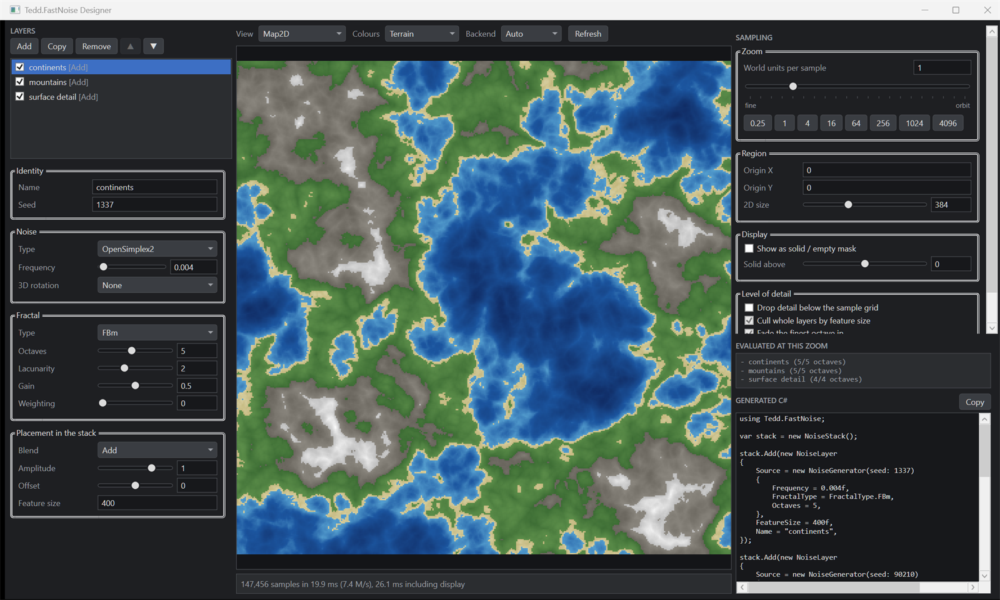

# Tedd.FastNoise

[](https://github.com/tedd/Tedd.FastNoise/actions/workflows/ci.yml)
[](https://www.nuget.org/packages/Tedd.FastNoise/)
[](https://tedd.no/Tedd.FastNoise/)

Deterministic coherent noise for voxel worlds and terrain, built for bulk generation.

Perlin, OpenSimplex2, Value and Cellular noise in 2D and 3D, with fractal layering, domain warping,
a fusing layer stack and level-of-detail control. Single-point sampling when you need one value;
SIMD and multi-core volume fills when you need a million.

The algorithms started as a port of [FastNoiseLite](https://github.com/Auburn/FastNoiseLite), with
the generation loop rebuilt around filling buffers instead of answering one question at a time.
Where the two still agree, the port is verified against the original; where this library goes
further, it goes further.

```csharp
var noise = new NoiseGenerator(seed: 1337)
{
    NoiseType = NoiseType.OpenSimplex2,
    FractalType = FractalType.FBm,
    Octaves = 5,
    Frequency = 0.005f,
};

// One 16x16x256 world column, vectorised across every core.
var density = new float[16 * 256 * 16];
noise.Fill(density, new GridRegion3D(chunkX * 16, 0, chunkZ * 16, 16, 256, 16));
```

---

## Install

```bash
dotnet add package Tedd.FastNoise
```

Targets .NET 10. .NET 11 is validated in CI and enabled with `-p:EnableNet11=true` until it ships.

---

## Why this exists

A noise library that only offers `GetNoise(x, y, z)` forces you to call it once per voxel. That
throws away the two things that make bulk generation fast: sixteen lanes of a vector register doing
the same arithmetic on adjacent coordinates, and the fact that a chunk's worth of samples is
independent work that can be spread across cores. Neither is available to a function that returns
one float.

So the primary API here is a fill:

- `Fill(destination, region)` for a rectangle or a box of samples
- a **layer stack** that runs several noise sources against coordinates held in registers, instead
  of a buffer per source
- a **level-of-detail policy** that drops octaves the sample grid cannot represent

Single-point sampling is still there, and still matches the reference exactly. It is just not where
the speed is.

---

## What you get

### Every backend produces identical bytes

Scalar, SIMD and parallel fills are bit-for-bit equal, on x86 and on ARM, at any vector width. This
is a hard guarantee, and the test suite asserts it directly rather than checking values are close.

It matters because a float is usually compared against a threshold — `density > 0` decides whether
a voxel is stone or air — and a one-ULP disagreement between a client with AVX-512 and a server on
the scalar fallback is a whole block of disagreement about the world.

Two consequences fall out of that promise:

- The kernels are written **once**, generically over an operation set, and instantiated per lane
  width. Scalar and SIMD cannot drift because they are the same source.
- Fused multiply-add is deliberately **not** used. It would be faster and it would change results
  by a fraction of an ULP relative to a machine without it.

### A port that was checked, not hoped at

The kernels here are not transcriptions. Branchy corner selection became mask arithmetic, loops were
unrolled, the whole thing was made generic over lane width -- and every one of those rewrites is a
chance to change a value by an ULP and never notice.

So an unmodified copy of FastNoiseLite is vendored into the test project as an oracle, and
`CompatibilityTests` compares every kernel against it for exact equality across the full matrix of
noise types, fractal types, cellular variants, rotations and domain warps. That is what makes the
rewrites safe to make. It found two real bugs while this was being built, both float association
differences invisible to a tolerance-based test.

Those tests describe the port as it stands today, not a promise about tomorrow. This library will
diverge from upstream as it grows -- new algorithms, better quality, features FastNoiseLite has no
reason to carry -- and where it does, the corresponding oracle test goes with it. Pin a version if
you need output stability.

### Layer stacks that fuse

A world is built from layers: continents, then mountains, then hills, then surface detail, then a
mask that keeps the detail out of the ocean.

```csharp
var stack = new NoiseStack { Lod = LodPolicy.Automatic with { CullLayers = true } };

stack.Add(new NoiseLayer
{
    Source = new NoiseGenerator(1) { Frequency = 0.0002f, FractalType = FractalType.FBm, Octaves = 4 },
    FeatureSize = 2000f,
    Name = "continents",
});

stack.Add(new NoiseLayer
{
    Source = new NoiseGenerator(2) { Frequency = 0.002f, FractalType = FractalType.Ridged, Octaves = 5 },
    Blend = LayerBlend.Add,
    Amplitude = 0.4f,
    FeatureSize = 200f,
    Name = "mountains",
});

stack.Add(new NoiseLayer
{
    Source = new NoiseGenerator(3) { Frequency = 0.05f, NoiseType = NoiseType.Value },
    Amplitude = 0.02f,
    FeatureSize = 8f,
    Name = "surface detail",
});

var world = stack.Compile();          // immutable, thread-safe, hand it to workers
world.Fill(heights, new GridRegion2D(0, 0, 512, 512));
```

The obvious way to combine layers is to fill a buffer per layer and then walk the buffers adding
them up. Eight layers over a 512×512 tile means eight full passes writing a megabyte each, then a
ninth reading it all back.

`Compile()` flattens the stack into a flat array of layer plans, and the fill runs every layer
against the coordinates currently in a vector register, blending into an accumulator that never
leaves the register file. Total memory traffic is one write per output value regardless of layer
count.

Blends: `Add`, `Subtract`, `Multiply`, `Min`, `Max`, `Replace`, `Lerp`. The first layer to survive
culling initialises the accumulator; its blend is ignored.

### Zoom levels that cost what they should

Sampling an eight-octave fractal every 512 world units is not just wasteful, it is wrong. Octaves
with a wavelength below the sample spacing contribute aliasing, not detail — and when the camera
moves, the aliasing changes, so the distant landscape boils.

`LodPolicy` drops octaves the sample grid cannot carry, and (with `CullLayers`) skips whole layers
whose `FeatureSize` is below the spacing:

```csharp
var noise = new NoiseGenerator(1337)
{
    FractalType = FractalType.FBm,
    Octaves = 8,
    Lod = LodPolicy.Automatic,
};

noise.Fill(closeUp,  new GridRegion2D(0, 0, 256, 256, step: 1f));      // all 8 octaves
noise.Fill(fromOrbit, new GridRegion2D(0, 0, 256, 256, step: 4096f));  // 1 octave, and correct
```

`FadeLastOctave` ramps the finest surviving octave's amplitude across the cull boundary so detail
appears smoothly as you approach rather than popping in. The normalisation constant is deliberately
*not* recomputed for the reduced octave count — renormalising would make the coarse rendering of a
landscape a different height from the fine one, and the terrain would visibly breathe as you flew
toward it.

Off by default, because with it off the output is bit-identical to FastNoiseLite at any step.

`CompiledNoiseStack.DescribeActiveLayers(step)` tells you what a given zoom level will actually
evaluate, so you can check a policy does what you meant.

### GPU, when you have one

`INoiseAccelerator` is the extension point: register one and `NoiseBackend.Gpu` routes large fills
to it. With none registered, `Gpu` silently means `Parallel`, and an accelerator can decline any
individual fill (too small, unsupported configuration) and get the CPU path instead. The fallback
chain is `Gpu → Parallel → Simd → Scalar`, and every link is tested.

**Status:** the interface, the dispatch and the fallback are implemented and tested. The
`Tedd.FastNoise.Gpu` package that implements it is not written yet. See
[Not done yet](#not-done-yet).

---

## API

### Sampling one point

```csharp
float v2 = noise.GetNoise(x, y);
float v3 = noise.GetNoise(x, y, z);
```

### Filling a region

```csharp
noise.Fill(destination, new GridRegion2D(originX, originY, width, height, step));
noise.Fill(destination, new GridRegion3D(originX, originY, originZ, width, height, depth, step));

float[] created = noise.Create(region);                        // allocates for you
noise.Fill(destination, region, NoiseBackend.Simd);            // force a backend
GridRegion3D chunk = GridRegion3D.Chunk(cx, cy, cz, size: 16); // one chunk of a chunked world
```

Results are written X-fastest: `destination[x + width * (y + height * z)]`. Nothing in the library
assumes which world axis is up.

### Settings

Same names and defaults as FastNoiseLite: `Seed`, `Frequency`, `NoiseType`, `RotationType3D`,
`FractalType`, `Octaves`, `Lacunarity`, `Gain`, `WeightedStrength`, `PingPongStrength`,
`CellularDistanceFunction`, `CellularReturnType`, `CellularJitter`, `DomainWarpType`,
`DomainWarpAmplitude`. Plus `Lod` and `ParallelThreshold`.

### Noise types

| Type | Cost | Use it for |
| --- | --- | --- |
| `OpenSimplex2` | moderate | The default. No axis alignment, so it holds up in 3D density fields. |
| `OpenSimplex2S` | high | Smoother variant. Scalar only — no wide kernel (see below). |
| `Perlin` | low | Heightmaps, where mild axis alignment does not show. |
| `Value` | lowest | Anything that gets thresholded or quantised: ore scatter, per-block variation. |
| `ValueCubic` | highest | Smooth low-frequency fields. Reads 64 lattice points per 3D sample. |
| `Cellular` | high | Caves, ore pockets, biome regions, cracks. |

`OpenSimplex2S` selects its corners with a rank comparison chain, and lanes in a vector disagree
about which branch to take. Rather than evaluate every arm speculatively, bulk fills run the
reference scalar implementation per sample for that type — still parallelised, just not vectorised.
A layer stack fuses as a unit, so one `OpenSimplex2S` layer holds the whole stack to the scalar
path; `CompiledNoiseStack.IsVectorised` tells you when that has happened.

---

## Performance

Numbers are not published here yet. The benchmark project is written and the questions it answers
are fixed; the table lands once the suite has been run on a machine worth quoting.

What it measures, and against what:

| Benchmark | Question |
| --- | --- |
| `PointSampling` | Does writing the kernels generically over a lane-width abstraction cost anything? The scalar path should tie with the hand-written reference running identical arithmetic. |
| `Heightmap2D` | What does a 2D fill cost across scalar, SIMD and parallel, against FastNoiseLite called per sample and against the frozen 2020 implementation in `archive/v1`? |
| `VoxelVolume3D` | What does one 16x16x256 world column cost, per noise type? |
| `LayerFusion` | Does fusing layers into one pass beat a buffer per layer? Should widen with layer count, since the naive version is bound by memory traffic the fused one never generates. |
| `LevelOfDetail` | What does band-limiting actually save at each zoom level? |
| `GatherStrategy` | Hardware `vgatherdps` against a spill-and-index loop for the gradient table reads. |

Run them:

```bash
dotnet run -c Release --project src/Tedd.FastNoise.Benchmark -- --filter "*"
```

Or one at a time:

```bash
dotnet run -c Release --project src/Tedd.FastNoise.Benchmark -- --filter "*Heightmap2D*"
```

---

## The designer

A Windows app for building a stack visually instead of guessing at frequencies and recompiling.



- **2D map** — the field as an image, in greyscale, terrain, diverging or viridis colours, with an
  optional solid/empty mask at a threshold so you can see exactly where terrain would cut.
- **3D heightmap** — the same field displaced into terrain, lit and rotatable.
- **3D volume** — a 3D field thresholded into voxels and meshed from its exposed faces, rotatable.
- **Layers** — add, reorder, blend, and toggle layers with every generator setting live.
- **Zoom sweep** — drag the sample spacing from sub-block to orbital and watch which layers and
  octaves survive level-of-detail culling, and what the fill costs.
- **Generated C#** — the code that reproduces whatever is on screen, ready to paste.

Drag to orbit, right-drag to pan, wheel to zoom. Every preview shows its own fill time and
throughput, so it doubles as a rough profiler for a configuration.

Download the latest build from
[Releases](https://github.com/tedd/Tedd.FastNoise/releases/latest), or build it yourself:

```bash
dotnet run -c Release --project src/Tedd.FastNoise.Designer
```

---

## How the repository is laid out

```
src/Tedd.FastNoise/            the library
src/Tedd.FastNoise.Tests/      xUnit, including the vendored reference used as the oracle
src/Tedd.FastNoise.Benchmark/  BenchmarkDotNet
src/Tedd.FastNoise.Designer/   the WPF designer
tools/Tedd.FastNoise.Gallery/  renders the sample images for the documentation site
docs/                          the GitHub Pages site
archive/v1/                    the 2020 implementation, frozen
```

`archive/v1` is not dead code kept out of sentiment. It is the fixed reference point every
performance claim is measured against; it is retargeted to a supported framework and otherwise
untouched, because a moving baseline measures nothing.

The same discipline applies to the benchmark project: each class documents the question it answers,
and nothing lands in the library on the strength of an argument that it ought to be faster.

### Building

```bash
dotnet build src/Tedd.FastNoise.slnx -c Release
dotnet test src/Tedd.FastNoise.Tests -c Release
dotnet test src/Tedd.FastNoise.Tests -c Release -f net11.0 -p:EnableNet11=true   # needs the .NET 11 SDK
```

---

## Releasing

Two workflows, with a clean split between checking and shipping.

`ci.yml` runs on every push and pull request and publishes nothing. It builds and tests on Linux,
on ARM64 and on Windows -- three instruction sets, because bit-identical output across backends is
a promise this library makes and one machine cannot check it -- plus a non-blocking .NET 11 preview
run.

`deploy.yml` runs only on a push to the **`deploy`** branch, and is the only thing that ships:

- the NuGet package, if `<Version>` in the csproj changed since the last publish
- a GitHub release carrying the self-contained Windows designer
- the documentation site to GitHub Pages, with its gallery rendered by the library at build time

So the release procedure is: merge to `master`, watch CI go green, bump `<Version>`, then

```bash
git push origin master:deploy
```

Two secrets and one setting are needed: `NUGET_API_KEY` in the repository secrets, and Pages
configured with **GitHub Actions** as its source.

---

## Not done yet

- **`Tedd.FastNoise.Gpu`.** The accelerator interface, dispatch and fallback are implemented and
  tested; the package that implements `INoiseAccelerator` against a GPU is not written. The hard
  part is not the kernel, it is keeping GPU output bit-identical to the CPU so the determinism
  guarantee survives — an accelerator that cannot manage that should decline the work rather than
  silently produce a slightly different world.
- **Domain warp in bulk.** `DomainWarp` works per point, via the reference implementation. There is
  no vectorised warp inside the fill loop yet, so warping a whole region means warping coordinates
  yourself and sampling per point.
- **4D noise.** FastNoiseLite does not have it either; it would be useful for looping animation.

---

## Licence

LGPL 2.1 — see [LICENSE](LICENSE).

Incorporates FastNoiseLite by Jordan Peck under the MIT licence; see
[THIRD-PARTY-NOTICES.md](THIRD-PARTY-NOTICES.md) for what is used and where.
